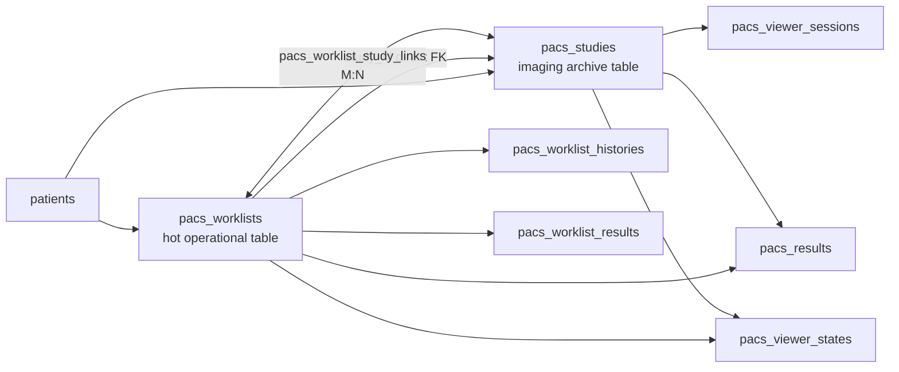

# UDAYA PACS — Database ER Diagram & Relationships

> Source of truth: Flyway migrations in `PACS_API/src/main/resources/db/migration` (V1 → V18x).
> Database: **PostgreSQL**. All `id` columns are `BIGSERIAL` primary keys unless noted.
> Generated by reverse-engineering every `CREATE TABLE`, `REFERENCES`, `FOREIGN KEY`, rename and drop.

## How to read this

- **`||--o{`** = one-to-many (parent `||` → many children `o{`).
- **`}o--||`** = many-to-one.
- A table that references `hospitals` is **hospital-scoped** (multi-tenant). Almost every business table carries `hospital_id`.
- **Soft / audit columns** (`created_by`, `modified_by`) point at `users.id` but are mostly *logical* links (no hard FK) — they are listed in the notes, not drawn, to keep the diagram readable.
- Tables renamed by **V113** (`pacs_patient_queue` → `pacs_worklists` and its children) are shown under their **final** names.

---

## 1. Master ER Diagram (all hard relationships)

```mermaid
erDiagram
    %% ===================== IDENTITY & TENANCY =====================
    users {
        bigint id PK
        varchar username UK
        varchar email UK
        varchar password
        smallint user_type
        bigint permission_version
        smallint is_active
    }
    hospitals {
        bigint id PK
        varchar code UK
        varchar name
        varchar ae_title
        text dicomweb_base_url
        varchar timezone
    }
    user_hospitals {
        bigint id PK
        bigint user_id FK
        bigint hospital_id FK
        boolean is_default
    }
    refresh_tokens {
        bigint id PK
        bigint user_id FK
        bigint hospital_id FK
        bigint rotated_from_id FK
        varchar token_hash UK
    }

    %% ===================== RBAC / PERMISSIONS =====================
    module_types {
        bigint id PK
        varchar code UK
    }
    modules {
        bigint id PK
        bigint module_type_id FK
        varchar code UK
        varchar route_path
    }
    module_details {
        bigint id PK
        bigint module_id FK
        varchar code UK
        varchar type
    }
    roles {
        bigint id PK
        bigint hospital_id FK
        varchar code
        boolean is_system_role
    }
    role_module_details {
        bigint id PK
        bigint role_id FK
        bigint module_detail_id FK
    }
    user_groups {
        bigint id PK
        bigint user_id FK
        bigint hospital_id FK
        bigint role_id FK
    }
    endpoint_permissions {
        bigint id PK
        varchar http_method
        varchar endpoint_pattern
        varchar permission_code
    }
    system_activities {
        bigint id PK
        bigint module_id FK
        bigint created_by FK
    }

    %% ===================== MODALITY & SERVICE =====================
    modalities {
        bigint id PK
        varchar name
    }
    services {
        bigint id PK
        varchar code
        varchar name
    }
    hospital_modalities {
        bigint id PK
        bigint hospital_id FK
        bigint modality_id FK
    }
    hospital_modality_services {
        bigint id PK
        bigint hospital_id FK
        bigint modality_id FK
        bigint service_id FK
    }

    %% ===================== DICOM INFRASTRUCTURE =====================
    hospital_dicom_servers {
        bigint id PK
        bigint hospital_id FK
        varchar ae_title
        varchar ip_address
        integer port
    }
    hospital_dicom_routing_configs {
        bigint id PK
        bigint hospital_id FK
    }
    hospital_dicom_machines {
        bigint id PK
        bigint hospital_id FK
        bigint modality_id
        varchar machine_ae_title
    }
    hospital_modality_server_routes {
        bigint id PK
        bigint hospital_id FK
        bigint modality_id FK
        bigint dicom_server_id FK
        bigint machine_id FK
        bigint routing_config_id FK
    }
    dicom_server_callback_log {
        bigint id PK
        varchar accession_number
        varchar dicom_server_study_id
    }

    %% ===================== PACS CLINICAL CORE =====================
    patients {
        bigint id PK
        bigint hospital_id FK
        varchar patient_uid
        varchar name
    }
    pacs_studies {
        bigint id PK
        bigint hospital_id FK
        bigint patient_id FK
        bigint modality_id FK
        bigint dicom_server_id FK
        bigint assigned_to FK
        varchar study_instance_uid UK
    }
    pacs_worklists {
        bigint id PK
        bigint hospital_id FK
        bigint patient_id FK
        bigint study_id FK
        bigint service_id FK
        bigint modality_id FK
        bigint dicom_server_id FK
        bigint dicom_route_id FK
        bigint assigned_to FK
        varchar visit_code
        varchar status
    }
    pacs_worklist_histories {
        bigint id PK
        bigint hospital_id FK
        bigint worklist_id FK
        bigint patient_id FK
        varchar from_status
        varchar to_status
    }
    pacs_worklist_study_links {
        bigint id PK
        bigint hospital_id FK
        bigint worklist_id FK
        bigint study_id FK
        smallint is_primary
    }
    pacs_worklist_results {
        bigint id PK
        bigint hospital_id FK
        bigint worklist_id FK
        text description
    }
    pacs_visit_sequences {
        bigint id PK
        bigint hospital_id FK
        varchar sequence_date
    }
    pacs_patient_sequences {
        bigint id PK
        bigint hospital_id FK
    }

    %% ===================== VIEWER =====================
    pacs_viewer_sessions {
        bigint id PK
        bigint hospital_id FK
        bigint user_id FK
        bigint study_id FK
        varchar token UK
    }
    pacs_viewer_states {
        bigint id PK
        uuid public_id UK
        bigint hospital_id FK
        bigint modality_id FK
        bigint study_id FK
        bigint worklist_id FK
        bigint patient_id FK
        jsonb viewer_state
    }

    %% ===================== STANDARD RESULTS =====================
    pacs_result_templates {
        bigint id PK
        bigint hospital_id FK
        bigint modality_id FK
        varchar template_name
    }
    pacs_results {
        bigint id PK
        bigint hospital_id FK
        bigint modality_id FK
        bigint study_id FK
        bigint queue_id FK
        bigint patient_id FK
        bigint template_id FK
        varchar status
    }
    pacs_result_images {
        bigint id PK
        bigint result_id FK
        bigint hospital_id FK
        bigint modality_id FK
        text image_path
    }

    %% ===================== RETENTION =====================
    study_retention_policies {
        bigint id PK
        bigint hospital_id FK
        bigint dicom_server_id FK
        bigint modality_id FK
        integer retention_days
    }
    study_retention_delete_requests {
        bigint id PK
        bigint hospital_id FK
        bigint policy_id FK
        bigint dicom_server_id FK
        bigint modality_id FK
        varchar status
    }

    %% ===================== NOTIFICATIONS =====================
    pacs_realtime_notification_events {
        bigint id PK
        bigint hospital_id FK
        bigint worklist_id FK
        bigint study_id FK
        varchar dedupe_key
    }

    %% ===================== RELATIONSHIPS =====================
    %% Identity & tenancy
    users ||--o{ user_hospitals : "member of"
    hospitals ||--o{ user_hospitals : "has members"
    users ||--o{ refresh_tokens : "owns"
    hospitals ||--o{ refresh_tokens : "scoped to"
    refresh_tokens ||--o{ refresh_tokens : "rotated from"

    %% RBAC
    module_types ||--o{ modules : "groups"
    modules ||--o{ module_details : "has actions"
    hospitals ||--o{ roles : "defines"
    roles ||--o{ role_module_details : "grants"
    module_details ||--o{ role_module_details : "granted by"
    users ||--o{ user_groups : "assigned"
    hospitals ||--o{ user_groups : "scoped to"
    roles ||--o{ user_groups : "applied as"
    modules ||--o{ system_activities : "logged for"
    users ||--o{ system_activities : "performed by"

    %% Modality & service
    hospitals ||--o{ hospital_modalities : "enables"
    modalities ||--o{ hospital_modalities : "enabled at"
    hospitals ||--o{ hospital_modality_services : "offers"
    modalities ||--o{ hospital_modality_services : "via"
    services ||--o{ hospital_modality_services : "as"

    %% DICOM infrastructure
    hospitals ||--o{ hospital_dicom_servers : "owns"
    hospitals ||--o{ hospital_dicom_routing_configs : "owns"
    hospital_modalities ||--o{ hospital_dicom_machines : "houses"
    hospital_modalities ||--o{ hospital_modality_server_routes : "routes"
    hospital_dicom_servers ||--o{ hospital_modality_server_routes : "destination"
    hospital_dicom_machines ||--o{ hospital_modality_server_routes : "source machine"
    hospital_dicom_routing_configs ||--o{ hospital_modality_server_routes : "groups"

    %% Clinical core
    hospitals ||--o{ patients : "registers"
    hospitals ||--o{ pacs_studies : "owns"
    patients ||--o{ pacs_studies : "has"
    hospital_modalities ||--o{ pacs_studies : "of modality"
    hospital_dicom_servers ||--o{ pacs_studies : "received from"
    users ||--o{ pacs_studies : "assigned radiologist"

    hospitals ||--o{ pacs_worklists : "owns"
    patients ||--o{ pacs_worklists : "for"
    pacs_studies ||--o{ pacs_worklists : "links"
    services ||--o{ pacs_worklists : "of service"
    modalities ||--o{ pacs_worklists : "of modality"
    hospital_dicom_servers ||--o{ pacs_worklists : "targets"
    hospital_modality_server_routes ||--o{ pacs_worklists : "routed via"

    hospitals ||--o{ pacs_worklist_histories : "owns"
    pacs_worklists ||--o{ pacs_worklist_histories : "transitions"
    patients ||--o{ pacs_worklist_histories : "for"

    hospitals ||--o{ pacs_worklist_study_links : "owns"
    pacs_worklists ||--o{ pacs_worklist_study_links : "links"
    pacs_studies ||--o{ pacs_worklist_study_links : "linked"

    hospitals ||--o{ pacs_worklist_results : "owns"
    pacs_worklists ||--o{ pacs_worklist_results : "result of"

    hospitals ||--o{ pacs_visit_sequences : "counter"
    hospitals ||--o{ pacs_patient_sequences : "counter"

    %% Viewer
    hospitals ||--o{ pacs_viewer_sessions : "owns"
    users ||--o{ pacs_viewer_sessions : "opened by"
    pacs_studies ||--o{ pacs_viewer_sessions : "views"
    hospitals ||--o{ pacs_viewer_states : "owns"
    modalities ||--o{ pacs_viewer_states : "of modality"
    pacs_studies ||--o{ pacs_viewer_states : "for study"
    pacs_worklists ||--o{ pacs_viewer_states : "for worklist"
    patients ||--o{ pacs_viewer_states : "for patient"

    %% Standard results
    hospitals ||--o{ pacs_result_templates : "owns"
    modalities ||--o{ pacs_result_templates : "for modality"
    hospitals ||--o{ pacs_results : "owns"
    modalities ||--o{ pacs_results : "of modality"
    pacs_studies ||--o{ pacs_results : "of study"
    pacs_worklists ||--o{ pacs_results : "of worklist"
    patients ||--o{ pacs_results : "for patient"
    pacs_result_templates ||--o{ pacs_results : "uses"
    pacs_results ||--o{ pacs_result_images : "has images"
    hospitals ||--o{ pacs_result_images : "owns"
    modalities ||--o{ pacs_result_images : "of modality"

    %% Retention
    hospitals ||--o{ study_retention_policies : "owns"
    hospital_dicom_servers ||--o{ study_retention_policies : "scopes"
    modalities ||--o{ study_retention_policies : "scopes"
    hospitals ||--o{ study_retention_delete_requests : "owns"
    study_retention_policies ||--o{ study_retention_delete_requests : "triggers"
    hospital_dicom_servers ||--o{ study_retention_delete_requests : "on server"
    modalities ||--o{ study_retention_delete_requests : "of modality"

    %% Notifications
    hospitals ||--o{ pacs_realtime_notification_events : "owns"
    pacs_worklists ||--o{ pacs_realtime_notification_events : "about"
    pacs_studies ||--o{ pacs_realtime_notification_events : "about"
```

---

## 2. Domain map (what each cluster does)

| Domain | Tables | Purpose |
|---|---|---|
| **Identity & Tenancy** | `users`, `hospitals`, `user_hospitals`, `refresh_tokens` | Who can log in, which hospitals they belong to, session refresh. |
| **Auth tokens / audit** | `oauth2_clients`, `oauth2_access_tokens`, `revoked_tokens`, `auth_audits`, `user_logs` | OAuth2 client registry, issued/revoked tokens, login audit trail. |
| **RBAC / Permissions** | `module_types`, `modules`, `module_details`, `roles`, `role_module_details`, `user_groups`, `endpoint_permissions` | Menu/module tree → action permissions → roles → per-hospital user assignment. `endpoint_permissions` maps each API route to a `permission_code`. |
| **Modality & Service** | `modalities`, `services`, `hospital_modalities`, `hospital_modality_services` | Global catalogs + per-hospital enablement (junction tables). |
| **DICOM Infrastructure** | `hospital_dicom_servers`, `hospital_dicom_routing_configs`, `hospital_dicom_machines`, `hospital_modality_server_routes`, `dicom_server_callback_log` | Where images are stored/sent, which physical machine feeds which server, and the routing rules. |
| **Clinical Core** | `patients`, `pacs_studies`, `pacs_worklists`, `pacs_worklist_histories`, `pacs_worklist_study_links`, `pacs_worklist_results`, `pacs_visit_sequences`, `pacs_patient_sequences` | The operational worklist + the imaging archive (`pacs_studies`) and their many-to-many link table. |
| **Viewer** | `pacs_viewer_sessions`, `pacs_viewer_states` | Short-lived OHIF launch tokens + persisted viewer state (measurements/annotations/segmentations). |
| **Standard Results** | `pacs_results`, `pacs_result_images`, `pacs_result_templates` | Structured radiology results, attached images, and report templates. |
| **Retention** | `study_retention_policies`, `study_retention_delete_requests` | Auto-expiry policies and the human-approval delete workflow. |
| **Notifications & Settings** | `pacs_realtime_notification_events`, `pacs_system_settings` | Durable SSE outbox + runtime key/value settings. |

---

## 3. The two central hubs

Almost every relationship fans out from two tables:

### `hospitals` (multi-tenant root)
Nearly every business table has `hospital_id → hospitals(id)`. This is the tenant boundary. **27+ tables** reference it directly.

### `pacs_worklists` ⇄ `pacs_studies` (the operational ⇄ archive split)
This is the most important clinical relationship and the design centerpiece:

- `pacs_worklists` = the **hot operational queue** (registration → image received → translated → completed).
- `pacs_studies` = the **imaging archive** (study/series/instance UIDs, DICOM server reference).
- They are linked **two ways**: a direct `pacs_worklists.study_id` FK (1:1 primary), and the `pacs_worklist_study_links` junction (1 worklist ↔ many studies for multi-study visits). `is_primary = 1` marks the main study.

---

## 4. Composite foreign keys (multi-column integrity)

The schema was "hardened for big data" — several FKs are **composite** so a child can never point at a parent row in a *different hospital*:

| Child table | Composite FK columns | Parent (columns) |
|---|---|---|
| `pacs_studies` | `(hospital_id, modality_id)` | `hospital_modalities (hospital_id, modality_id)` |
| `pacs_studies` | `(dicom_server_id, hospital_id)` | `hospital_dicom_servers (id, hospital_id)` |
| `pacs_worklists` | `(patient_id, hospital_id)` | `patients (id, hospital_id)` |
| `pacs_worklists` | `(dicom_server_id, hospital_id)` | `hospital_dicom_servers (hospital_id, id)` |
| `pacs_worklist_histories` | `(queue_id, hospital_id)` | `pacs_worklists (id, hospital_id)` |
| `hospital_dicom_machines` | `(hospital_id, modality_id)` | `hospital_modalities (hospital_id, modality_id)` |
| `hospital_modality_server_routes` | `(hospital_id, modality_id)` | `hospital_modalities (hospital_id, modality_id)` |
| `hospital_modality_server_routes` | `(dicom_server_id, hospital_id)` | `hospital_dicom_servers (id, hospital_id)` |

---

## 5. Junction (many-to-many) tables

| Junction table | Connects | Meaning |
|---|---|---|
| `user_hospitals` | `users` ↔ `hospitals` | A user can work at many hospitals. |
| `user_groups` | `users` ↔ `hospitals` ↔ `roles` | A user holds a role *within* a hospital. |
| `role_module_details` | `roles` ↔ `module_details` | A role grants specific action permissions. |
| `hospital_modalities` | `hospitals` ↔ `modalities` | Which modalities a hospital runs. |
| `hospital_modality_services` | `hospitals` ↔ `modalities` ↔ `services` | Which services a hospital offers per modality. |
| `hospital_modality_server_routes` | `hospital_modalities` ↔ `hospital_dicom_servers` (+ machine) | Routing rules: modality → destination server. |
| `pacs_worklist_study_links` | `pacs_worklists` ↔ `pacs_studies` | Multi-study visits. |

---

## 6. Audit / soft links (NOT drawn above)

These columns reference `users(id)` for "who created/modified" but are mostly **logical** (only some are hard FKs). Present on nearly every table:

- `created_by`, `modified_by` → `users.id`
- Retention requests add `requested_by`, `approved_by`, `rejected_by` → `users.id`
- `pacs_viewer_states` adds `deleted_by` → `users.id`
- `pacs_worklists` adds `translated_by` → `users.id`

Tables with **no hard FKs** (deliberately decoupled hot-path / log tables): `revoked_tokens`, `auth_audits`, `oauth2_access_tokens`, `oauth2_clients`, `endpoint_permissions`, `countries`, `dicom_server_callback_log`, `pacs_system_settings`, `system_activities` (FKs dropped in V37), `pacs_viewer_states` (FKs added `NOT VALID` in V170/V171).

---

## 7. Schema history notes (so names match the live DB)

- **V113** renamed the queue family → worklist family:
  `pacs_patient_queue` → **`pacs_worklists`**, `pacs_patient_queue_histories` → **`pacs_worklist_histories`**, `pacs_queue_study_links` → **`pacs_worklist_study_links`**, `pacs_queue_results` → **`pacs_worklist_results`**.
  (Some FK *column* names still read `queue_id`/`worklist_id` interchangeably.)
- **V38** dropped the unused `activity_logs` table.
- **V119** split the reusable physical-machine library (`hospital_dicom_machines`) out of the routing rules; routes now reference machines by `machine_id`.
- **V95** introduced `hospital_dicom_routing_configs` to group routes per hospital.
- **V129 / V173** added `pacs_studies.dicom_server_id` and `pacs_studies.modality_id` relations.

---

*To view this diagram:* open in any Markdown viewer with Mermaid support (VS Code "Markdown Preview Mermaid Support", GitHub, GitLab, Obsidian, or https://mermaid.live).
