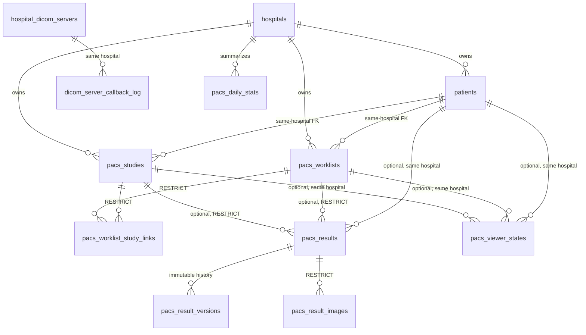

# PostgreSQL EMR/PACS deep refactor

Audit date: 2026-06-18  
Target: safe growth from 1M to 100M+ rows without breaking the current API.

## Outcome

The refactor is intentionally staged rather than implemented as a destructive
table rewrite.

- V185 scopes patient UID and visit-code uniqueness by hospital and removes
  confirmed duplicate indexes.
- V186 adds compatibility audit timestamps, callback idempotency metadata,
  tenant-aware result-image metadata, immutable result versions, daily dashboard
  summaries, and synchronization of the worklist/study compatibility relation.
- V187 creates large-table indexes concurrently.
- V188 installs hospital-safe composite foreign keys and replaces unsafe
  medical cascades. The new `NOT VALID` constraints protect new writes and
  parent deletes immediately; existing rows are validated separately online.
- Study list APIs now support `lastStudyId` keyset paging while preserving the
  existing offset contract.

No medical/history column or row is removed.

## Audit findings

### Critical risks addressed

1. `dicom_server_callback_log` had no hospital or DICOM-server scope and no
   durable retry identity.
2. Worklists and studies were related by both `pacs_worklists.study_id` and the
   link table, with no database synchronization guarantee.
3. Several medical relationships used single-column FKs, allowing the database
   to validate existence without validating tenant ownership.
4. Worklist/study links and result images used `ON DELETE CASCADE`.
5. Result images did not carry hospital scope, making future partitioned and
   hospital-local access paths harder.
6. Study list paging still allowed arbitrarily deep `OFFSET`.

### Medium risks

- `created`, `created_at`, `modified`, and `modified_at` are mixed across hot
  tables.
- Audit/event retention is operational rather than partition-driven.
- Broad trigram indexes need production usage evidence before being retained.
- Exact `COUNT(*)` for broad contains-searches does not scale to 100M rows.
- Core studies/worklists cannot be directly partitioned without redesigning
  primary/foreign keys that reference their numeric IDs.

### Low risks

- Some old single-column indexes remain until `pg_stat_statements` has captured
  at least one normal business cycle.
- `modality` text remains as raw DICOM metadata while `modality_id` is the
  normalized relation.
- Legacy audit columns remain for backward compatibility.

### Good structure retained

- Hospital-scoped study UID and patient/worklist business keys.
- UUID public keys with numeric internal join keys.
- Current viewer-state uniqueness and 10 MiB payload ceiling.
- Relative result-image paths rather than repeated public URLs.
- Durable notification dedupe and cursor replay.
- Retention approval snapshots.

## Target relationship map

`pacs_worklist_study_links` is canonical. `pacs_worklists.study_id` remains a
compatibility pointer and database triggers synchronize both directions.

Delete policy:

- clinical parents and clinical joins: `RESTRICT`;
- audit identity (`created_by`, `updated_by`): nullable/`SET NULL` where used;
- temporary replay/event data: retention or partition drop, not clinical
  cascade;
- physical DICOM/image deletion: approved retention workflow only.

## Index policy

### Added

- parent `(id, hospital_id)` unique indexes needed by composite FKs;
- active result uniqueness by `(hospital_id, study_id)` or
  `(hospital_id, worklist_id)`;
- result-image hospital/result and hospital/study access paths;
- callback hospital/date and server/date access paths;
- callback `(hospital_id, dedupe_key)` retry identity;
- result-version hospital/result/date history access;
- child-side indexes for realtime and retention composite FKs.

### Removed

- global patient/visit uniqueness and confirmed duplicates in V185;
- case-sensitive worklist visit-code unique index after the case-insensitive
  hospital-scoped replacement exists;
- case-sensitive patient UID constraint after the case-insensitive
  hospital-scoped replacement exists.

### Deferred

Unused or overlapping trigram and list indexes are not removed solely because
the local `idx_scan` value is zero. Production statistics reset and workload
coverage matter. Measure 7-14 days, then use the duplicate/overlap report and
remove only indexes whose plans are covered.

## Data and API compatibility

- New audit timestamps are nullable and dual-written by triggers.
- Historical values are backfilled in `5,000` row batches using
  `FOR UPDATE SKIP LOCKED`.
- Existing image rows remain readable while hospital metadata is backfilled.
- Result save conflict handling now matches the one-current-result-per-study or
  worklist rule.
- Callback retries update `attempt_count` and `last_received_at` instead of
  creating unlimited identical rows.
- Existing offset pagination remains available; clients should switch to
  `lastStudyId`, `lastWorklistId`, `lastPatientId`, `lastActivityId`, and
  `lastUserLogId`.

## Partition plan

Start with append-only/high-growth tables:

| Table | Key | Initial retention |
|---|---|---|
| `system_activities` | `created_at` | 6 months hot |
| `user_logs` | `created_at` | 6 months hot |
| `dicom_server_callback_log` | `received_at` | 90 days successful; longer failed |
| `pacs_realtime_notification_events` | `created_at` | 14 days |
| `pacs_worklist_histories` | `created_at` | policy-defined |
| `study_retention_delete_requests` | `created_at` | audit-defined |

Use monthly shadow tables:

1. create partitioned shadow parent and next 12 monthly partitions;
2. create a default quarantine partition;
3. dual-write or use logical replication;
4. backfill by month and bounded ID ranges;
5. compare row count, min/max ID, per-month count, and orphan checks;
6. pause writes briefly, copy the tail, swap names, and restore grants/FKs;
7. retain the previous table read-only for the rollback window.

Partition studies and worklists last. Their PK/FK graph requires either a
partition-inclusive identity or a routing layer; direct `ALTER TABLE ...
PARTITION BY` is not safe.

## Deployment order

1. Run `validate_pre_refactor.sql`.
2. Deploy V185-V188.
3. Run `backfill_compatibility_batch.sql` repeatedly until all remaining counts
   are zero.
4. Run `finalize_constraints.sql` in a monitored low-traffic window.
5. Run `validate_post_refactor.sql`.
6. Refresh yesterday/today dashboard rows with
   `pacs_refresh_daily_stats(date, hospital_id)`.
7. Rehearse partition shadows and load tests only in staging.

## Rollback

`rollback_v186_v188.sql` restores old compatibility indexes/FKs but deliberately
does not drop new columns, result versions, or summary data. A rollback must not
destroy newly captured medical audit history.

## Performance validation

Use the disposable scale lab at 1M, 10M, then 100M rows. For each size record:

- load rows/second and WAL;
- table/index bytes;
- list/search/lookup p50, p95, and p99;
- blocks read/hit, temporary bytes, rows filtered;
- callback and worklist insert latency under concurrent reads.

Targets:

- list p95 below 300 ms, p99 below 1 second;
- exact lookup p95 below 100 ms;
- worklist insert p95 below 150 ms;
- idempotent callback p95 below 300 ms;
- hospital/date study search p95 below 500 ms.

### Local scale-lab result

The guarded SQL lab was executed on this workstation:

| Rows | Table + indexes | Load/index time | Four query execution times |
|---:|---:|---:|---|
| 1,000,000 | 347 MB | 5.3 s | 0.087, 17.954, 0.042, 0.043 ms |
| 10,000,000 | 3.48 GB | 67.6 s | 0.252, 28.854, 0.987, 0.203 ms |

All plans were index-backed. These are SQL execution times on synthetic data,
not API p95/p99 measurements under concurrency. A 100M local run was not
attempted because linear storage projection was about 35 GB while the Docker
drive had 29.2 GB free. Run 100M plus concurrent API load on dedicated
production-equivalent infrastructure.

## Operational files

- `tools/sql/deep-database-refactor/validate_pre_refactor.sql`
- `tools/sql/deep-database-refactor/backfill_compatibility_batch.sql`
- `tools/sql/deep-database-refactor/finalize_constraints.sql`
- `tools/sql/deep-database-refactor/validate_post_refactor.sql`
- `tools/sql/deep-database-refactor/create_partition_shadows.sql`
- `tools/sql/deep-database-refactor/rollback_v186_v188.sql`
- `tools/sql/deep-database-refactor/loadtest/`
